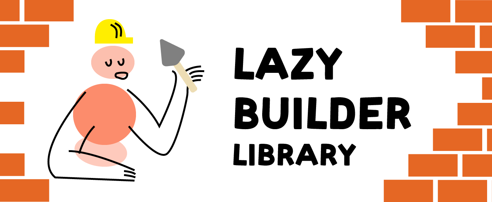
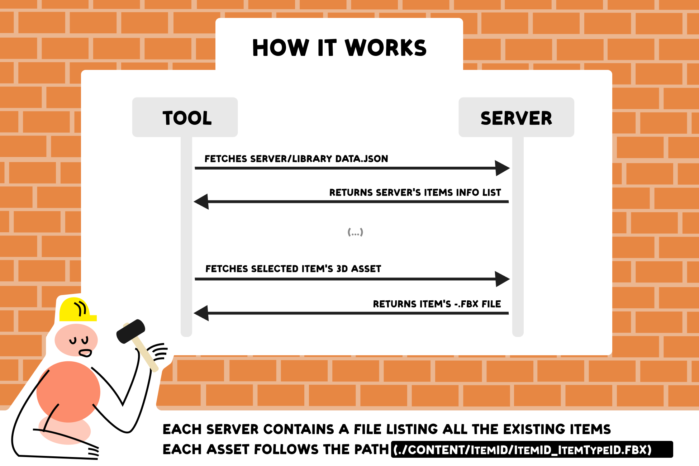

## Hundreds of CC0 3D assets available for everyone 🪣

Lazy Builder Library is the official asset collection of the Lazy Builder Tool. [(See asset list here)](./AssetList.md) 

 

## How the library works 🛰️
The assets are organized them based on their respective items **_ItemId_** & **_ItemTypeId_** properties. Each asset is stored follows the path (./content/**_ItemId_**/**_ItemId_**_**_ItemTypeId_**.fbx)

 

## Blender plugins to help build your library 🧰

To reduce the amount of manual labour and automate the naming & export processes, two blender plugins were created [(Available in the Releases Section)](https://github.com/wafflesgama/LazyBuilderLibrary/releases):

| Plugin   | About| Version| 
|--------------|------|----------------------------:|
| Lazy Rename            | A plugin that automatically renames the selected object based on the **_ItemId_** & **_ItemTypeId_** fields     | 1.00       | Public repositories only        |
| Lazy Batex          |  A modified version of the Batex plugin, to quickly export assets in FBX format from the base lib path   | 1.00       | Tested on Windows OS        |

 

## Expand its purpose 🚀

Even though its default use is to support the Lazy tool, feel free to use it as the database for any other game, project or software.

 

## Asset sources & credits🫂

Although every asset in this collection was edited & prepared to fit the necessary structure of the tool, the vast majority of the base meshes were imported from other CC0 libraries such as:

- [Everything Library](https://davidoreilly.itch.io/) from DΛVID OREILLY
- [Kenney Assets](https://kenney.nl/assets?q=3d) from Kenney

